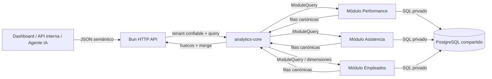
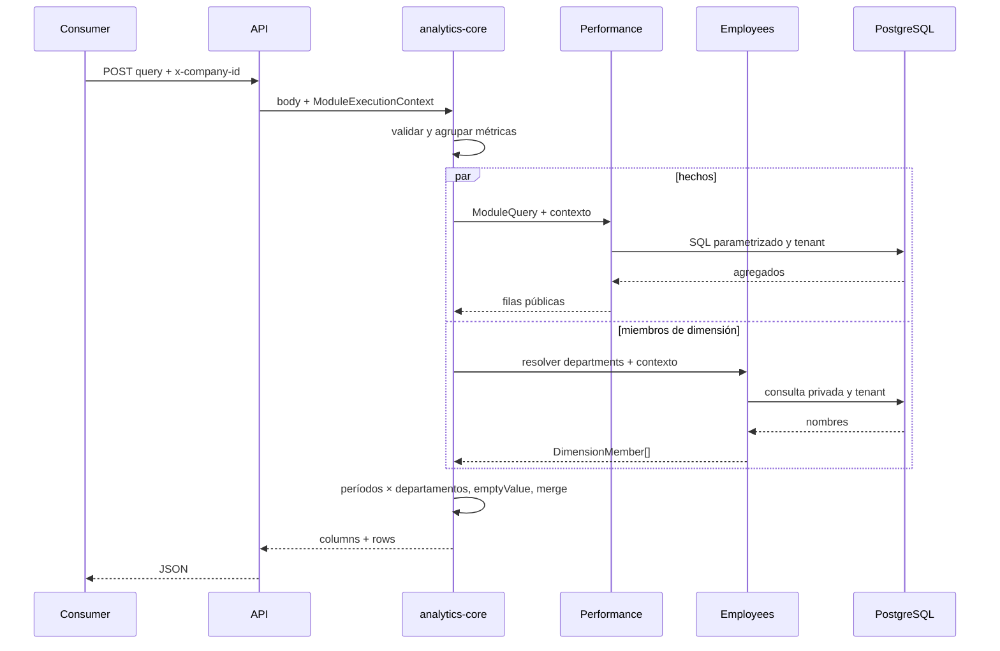
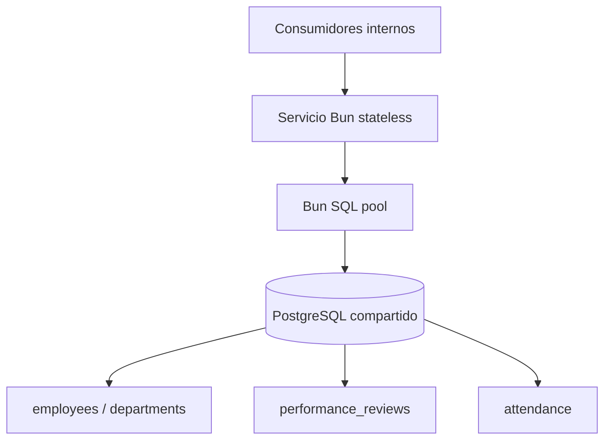

# Diseño técnico: capa semántica de analítica

## 1. Requisitos de la solución

**R1. Contrato semántico unificado.** Dashboards, APIs internas y agentes de IA deben consultar métricas y dimensiones mediante el mismo JSON declarativo, sin escribir SQL ni conocer tablas, columnas o joins.

**R2. Encapsulamiento modular.** Cada equipo debe registrar los nombres públicos, capacidades, filtros, granularidades y valores vacíos de sus métricas. El equipo dueño mantiene de forma privada la regla de negocio, la generación de SQL y su ejecución. El núcleo analítico no debe conocer ningún esquema de módulo.

**R3. Aislamiento multi-tenant.** Toda ejecución debe recibir automáticamente la empresa autenticada. El consumidor no puede enviar ni modificar `companyId`; todos los módulos deben limitar su SQL al contexto confiable recibido de la API.

**R4. Consultas correctas.** La solución debe validar solicitudes, delegar un plan semántico por fuente y producir el resultado equivalente a score promedio y evaluaciones completadas por departamento y trimestre durante 2025.

**R5. Series completas.** Al solicitar tiempo, la respuesta debe incluir períodos sin hechos. Cada métrica decide si la ausencia significa `0` o `null` mediante `emptyValue`.

**R6. Evolución desacoplada.** Un módulo puede cambiar su esquema o SQL sin afectar consumidores ni `analytics-core`, siempre que preserve su contrato público y el formato canónico de salida.

**R7. Extensibilidad.** Debe ser posible sumar módulos, estrategias de ejecución y consultas entre fuentes sin modificar el lenguaje público. Las fórmulas derivadas quedan diseñadas como evolución, pero no se implementan en este MVP.

El MVP es exitoso cuando las cuatro preguntas del caso y la consulta obligatoria de 2025 se ejecutan contra PostgreSQL, los huecos aparecen, dos empresas nunca se mezclan y las definiciones públicas no revelan detalles internos.

## 2. Solución propuesta

### 2.1 Decisión principal

Se implementa un servicio HTTP en un monorepo Bun. La capa tiene un núcleo de orquestación y adaptadores opacos mantenidos por los módulos. Esta separación evita reemplazar SQL ad-hoc entre consumidores por un gran generador central acoplado a todos los esquemas.

Hay dos contratos deliberadamente distintos:

1. El **contrato público** contiene nombres semánticos estables, descripciones, tipos, granularidades, filtros y `emptyValue`.
2. El **contrato de ejecución** entrega una `ModuleQuery` semántica y un `ModuleExecutionContext` confiable a una función opaca. El módulo interpreta los nombres que publicó, genera SQL parametrizado, lo ejecuta y devuelve filas canónicas.

`analytics-core` no recibe source tables, columnas, expresiones ni joins. Por ello, renombrar `performance_reviews.period` requiere modificar únicamente el adaptador de Performance.

### 2.2 Arquitectura de software



**API.** Expone `POST /api/v1/query`, `GET /api/v1/definitions` y `GET /health`. El middleware prototipo convierte `x-company-id` en contexto interno. El header no se refleja en la respuesta.

**Registro.** `AnalyticsRegistry` relaciona cada nombre público con el módulo que lo posee. También detecta nombres duplicados, referencias a dimensiones inexistentes y dimensiones sin resolver. No guarda SQL.

**Validador.** Rechaza campos desconocidos, métricas o dimensiones inexistentes, duplicados, fechas inválidas, combinaciones no soportadas y filtros incorrectos. Busca `companyId` recursivamente y lo prohíbe. Una consulta temporal requiere rango cerrado y granularidad. El MVP limita una solicitud a 120 buckets, 20 filtros, 100 valores por filtro, 500 valores totales y 100.000 filas del spine. No permite filtros duplicados sobre una dimensión.

**Orquestador.** Separa las métricas por módulo, delega las ejecuciones en paralelo, valida que cada adaptador devuelva el contrato canónico, completa huecos y combina fuentes por las claves públicas solicitadas.

**Adaptadores de módulo.** Conocen su esquema y SQL. Performance define que un score válido tiene `status = 'completed'`; Asistencia define su tasa como el promedio del booleano `present` multiplicado por 100; Empleados define el snapshot soportado por el esquema disponible.

### 2.3 Contratos

Consulta pública:

```json
{
  "metrics": ["performance.avgScore", "performance.completedReviews"],
  "dimensions": ["employees.department"],
  "time": {
    "granularity": "quarter",
    "from": "2025-01-01",
    "to": "2025-12-31"
  },
  "filters": [
    {
      "dimension": "employees.department",
      "operator": "eq",
      "value": "Engineering"
    }
  ]
}
```

Registro público simplificado:

```ts
{
  kind: "metric",
  name: "performance.avgScore",
  type: "number",
  supportedDimensions: ["employees.department"],
  supportedGranularities: ["month", "quarter", "year"],
  emptyValue: null
}
```

Interfaz opaca de un módulo:

```ts
interface AnalyticsModule {
  id: string;
  definitions: PublicDefinition[];
  execute(
    query: ModuleQuery,
    context: ModuleExecutionContext,
  ): Promise<ModuleResult>;
  resolveDimensionMembers?(request, context): Promise<DimensionMember[]>;
}
```

La API de definiciones publica el primer bloque, pero nunca el código de `execute`.

### 2.4 Flujo extremo a extremo



Para la consulta obligatoria, el adaptador Performance selecciona evaluaciones completadas, une empleados y departamentos dentro de su paquete, filtra el tenant y 2025, y agrupa por trimestre y departamento. Su SQL es equivalente al solicitado, pero constituye un detalle privado. El núcleo solo observa claves como `2025-01-01`, `Engineering`, `performance.avgScore: 85`.

### 2.5 Aislamiento multi-tenant

El cuerpo y el contexto de ejecución son tipos separados. El consumidor nunca construye `ModuleExecutionContext`; la API lo deriva del header prototipo y valida que sea un `BIGINT` positivo. Cada adaptador recibe obligatoriamente este contexto y parametriza su predicado tenant. Performance y Asistencia siempre unen sus facts con un empleado del mismo tenant, incluso cuando no se solicita departamento; los joins privados también comparan `company_id` cuando ambas tablas lo poseen.

La resolución de departamentos usa el mismo contexto. Esto es importante porque el spine temporal podría revelar nombres de otra empresa incluso si los hechos estuvieran bien filtrados.

Las pruebas cargan una segunda empresa con un departamento del mismo nombre, valores extremos y facts deliberadamente asociados a un empleado de otra empresa. Consultas con y sin dimensiones atraviesan los tres ejecutores y verifican que solo se devuelvan métricas consistentes con el tenant. Esta estrategia hace visible cualquier omisión accidental del filtro o del join tenant-aware.

El MVP no afirma que un header enviado directamente por Internet sea autenticación. En producción, un gateway o middleware autenticado debe construir el contexto. PostgreSQL Row-Level Security es la segunda barrera recomendada, aunque se excluye para conservar el esquema entregado.

### 2.6 Huecos y múltiples fuentes

El núcleo puede completar períodos sin consultar esquemas. Primero crea los buckets en memoria. Luego pide a cada dueño de dimensión sus miembros públicos ya filtrados por tenant. Un miembro contiene una clave opaca estable y un valor visible; por ejemplo, Empleados puede mapear internamente su ID a `Engineering` sin revelar qué columna utilizó. Para una dimensión, el core construye `periodos × departamentos`; finalmente busca los agregados por clave y aplica el valor vacío registrado.

Los conteos usan `0`, porque cero hechos representa una cantidad válida. `avgScore` y `attendance.rate` usan `null`, porque cero sugeriría un score o una asistencia observada que no existió.

Una consulta con Performance y Asistencia no une sus fact tables. El núcleo envía una consulta a cada adaptador, ambos agregan primero al mismo grano público y luego se hace un outer merge por tiempo y claves opacas de dimensión. El nombre sigue siendo el valor de salida, pero un rename concurrente no divide la misma entidad en dos claves. Así se evita multiplicar evaluaciones por registros diarios de asistencia.

### 2.7 Arquitectura de infraestructura



El servicio es stateless y puede escalar horizontalmente. Cada réplica mantiene un pool pequeño. En el MVP, Docker Compose levanta PostgreSQL 17 y aplica el esquema, índices y fixtures. Se agregan índices por tenant/fecha/estado y por claves de join. Para empresas de hasta 50.000 empleados, estos índices, los límites de cardinalidad y la agregación en PostgreSQL son suficientes para demostrar el enfoque; producción requeriría medir planes reales, timeouts y posiblemente preagregados.

### 2.8 Trazabilidad de requisitos

| Requisito | Implementación                                                        |
| --------- | --------------------------------------------------------------------- |
| R1        | JSON único, catálogo público y respuesta `columns + rows`             |
| R2        | `AnalyticsModule.execute` opaco; SQL solo en `modules/*`              |
| R3        | Header fuera del body, contexto obligatorio y pruebas con dos tenants |
| R4        | Validación central y ejecutor Performance probado para 2025           |
| R5        | Spine genérico y `emptyValue` por métrica                             |
| R6        | Nombre público separado del adaptador privado                         |
| R7        | Registro por módulo, partición por fuente y merge canónico            |

### 2.9 Limitaciones y trade-offs

**Tenant por contrato.** La capa obliga a entregar contexto, pero no puede inspeccionar SQL privado para demostrar que un equipo lo utilizó. Las pruebas de contrato mitigan el riesgo; RLS daría una garantía independiente en producción.

**Una dimensión demostrada.** El algoritmo genérico calcula un producto cartesiano de miembros. Con varias dimensiones relacionadas podría inventar combinaciones imposibles. Una evolución registraría un proveedor de tuples de dimensiones, manteniendo intacto el lenguaje público.

**Estado histórico incompleto.** `employees.active` representa el estado actual y no existe fecha de término. El MVP cuenta empleados actualmente activos cuya contratación ocurrió antes del cierre del bucket; no puede reconstruir bajas históricas.

**Rangos absolutos.** El API no interpreta “último año”. Dashboards o agentes convierten lenguaje relativo a `from` y `to`, lo que hace las consultas determinísticas.

**Fórmulas derivadas excluidas.** `attendance.rate` es una métrica nativa del módulo, no una fórmula pública entre métricas. Una evolución agregaría un evaluador posterior a la agregación para evitar cálculos fila a fila.

**Base compartida.** Facilita transacciones y operación del MVP, pero no resuelve fuentes remotas. El contrato asíncrono de ejecutores permite que un futuro módulo consulte otro almacén y retorne las mismas filas canónicas.

**Escala del score.** El DDL entregado usa `NUMERIC(4,2)`, cuyo máximo es `99.99`, aunque el comentario menciona `100.00`. Se conserva el esquema como fue solicitado y se documenta la inconsistencia; corregirlo requeriría una migración a `NUMERIC(5,2)`.

## 3. Riesgos

| Riesgo                                            | Mitigación y respuesta                                                                                                                         | Costo-beneficio                                                                                                   |
| ------------------------------------------------- | ---------------------------------------------------------------------------------------------------------------------------------------------- | ----------------------------------------------------------------------------------------------------------------- |
| Un adaptador omite el tenant                      | Contexto obligatorio, parámetros, joins tenant-aware y suite de contrato con datos de otra empresa. Agregar RLS en producción.                 | Las pruebas son baratas y detectan regresiones; RLS tiene costo operativo moderado y alto beneficio de seguridad. |
| Cambiar una definición pública rompe consumidores | Nombres versionados por convención, catálogo, pruebas de contrato y política de compatibilidad. Cambios internos permanecen privados.          | Mantener contratos limita renombres, pero reduce fuertemente el acoplamiento organizacional.                      |
| Consulta demasiado amplia consume PostgreSQL      | El MVP limita buckets, filtros y filas generadas; en producción agregar timeout, cuotas y observabilidad por métrica.                          | Los límites reducen flexibilidad extrema a cambio de proteger la base operacional.                                |
| Merge entre fuentes produce semántica incorrecta  | Cada fuente agrega primero al grano público; outer merge solo por claves normalizadas; no se unen facts.                                       | Hace más consultas, pero evita duplicaciones silenciosas y conserva ownership.                                    |
| Explosión del spine temporal                      | El MVP tiene una dimensión. Antes de sumar más, limitar cardinalidad y resolver tuples válidas en el dueño de dimensiones.                     | Evita complejidad prematura y deja explícito el punto de evolución.                                               |
| `activeCount` se interpreta como historia real    | Descripción pública explícita, documentación y `null`/limitación conocida. Incorporar historial de estados antes de prometer snapshots reales. | No se inventan datos; el costo es aceptar una métrica aproximada en el prototipo.                                 |
| Un módulo devuelve filas canónicas inválidas      | El core verifica tiempo, dimensiones, métricas, tipos y claves duplicadas antes del merge.                                                     | Validación pequeña con alto valor para aislar fallas entre equipos.                                               |

La elección central sacrifica la posibilidad de optimizar todas las fuentes dentro de un único SQL a cambio de encapsulación real: los consumidores y el núcleo analítico dependen de contratos semánticos, mientras que cada equipo conserva el conocimiento y la evolución de su implementación.
